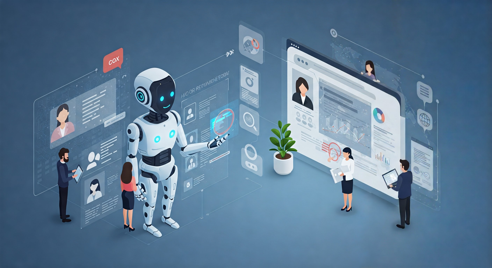
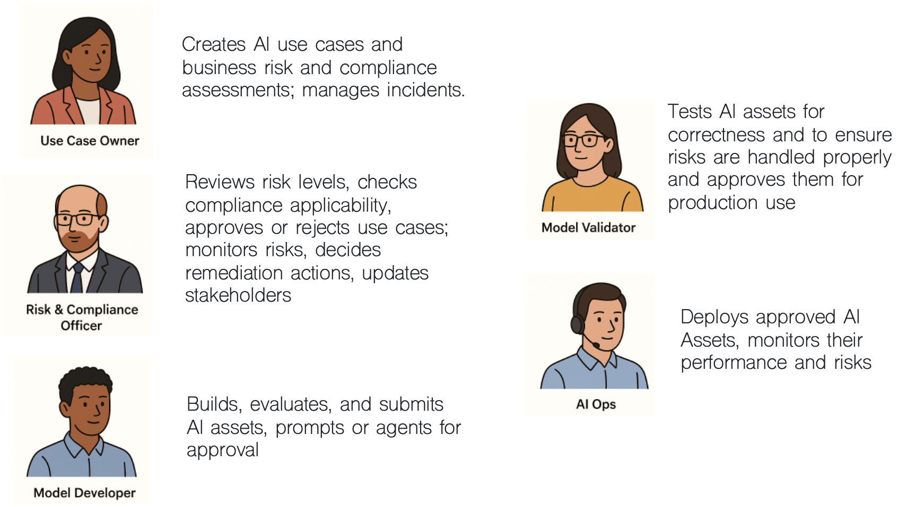
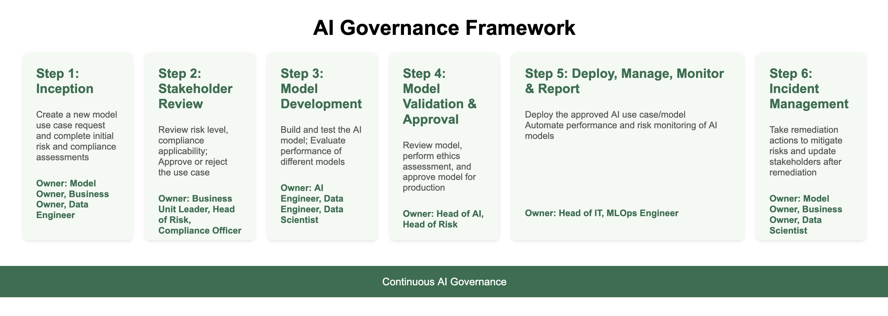
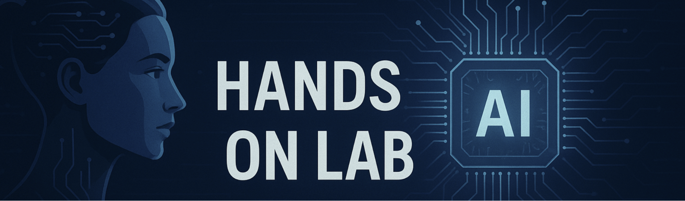

# 🧑‍💼 Managing AI Risk and Compliance with watsonx.governance

## Table of Contents
- [Introduction](#introduction)
- [Hands-on step-by-step lab](#hands-on-lab)
- [Guide directory](./guides-directory.md)

-------
# Introduction

## 👋 Meet Jose – The Chief Risk Officer

Jose works at **TechCorp Inc.**, a large multinational enterprise using AI to improve HR processes like hiring and employee planning.

But there was a problem...  
AI was everywhere, but **nobody really knew**:
- Who built what
- Whether the models were fair and safe
- Whether they complied to regulations like EU AI Act, etc.
- What to do when something went wrong

Jose was responsible for managing all that risk — but he had **no clear way** to do it.

So, Jose and his team decided to leverage **watsonx.governance** to make AI governance easy, clear, and reliable, and to enable collaboration with all the stakeholders, including Maria, the AI engineer.

## 🎯 What Jose Wanted to Fix

Jose didn’t want to manage critical governance processes through spreadsheets, emails or slack messages. 

He wanted a simple system that would:

- ✅ **Track every AI model from start to finish**
- ✅ **Make sure models follow the rules (like GDPR, EU AI Act, etc.)**
- ✅ **Foster collaboration with the development team — without slowing them down**
- ✅ **Catch problems early and fix them fast**
- ✅ **Keep everything ready for audits**

And that’s where **watsonx.governance** helps.

## 👥 Who's involved in AI Governance?

AI Governance is a team sport involving different roles in an organisation. Though it's not uncommon for one person to cover several personas, here's what these roles might look like:

## 🚀 The AI Governance Journey in 4 steps (Used by Jose's Team)

A simple, structured process for managing AI models from idea to remediation.

## 💬 What Jose Says Now

> _“Before watsonx.governance, we had no clear process. Now everyone knows what to do, models are better, and we’re always ready for audits.”_

------
-------

# 📄 Hands-on step-by-step guides

> [!IMPORTANT]
> In this lab, you will work through a real AI governance use case covering multiple personas. Each team member is assigned a role from the list above. For simplicity, all accounts have been granted privileges to run the steps for any persona via the **watsonx-governance MRG Master** profile.
> 
## ⚙️ Pre-requisites

* Access credentials (provided by the instructor)
* IBM Cloud login with the **watsonx-governance MRG Master** profile
* Services: OpenPages (all lab steps)

## ⚙️ Lab Guides directory

| Step | Activity | Persona | Guide |
|------|------|-------|---------------------|
| 1 | **Use Case Creation** | Use Case Owner | [Use Case Creation](./lab/1-use-case-creation/usecase-creation-model-owner.md) |
| 2 | **Risk & Compliance Review** | Risk & Compliance Officer | [Risk Review](./lab/1-use-case-creation/risk-review-rco.md), [Risk Endorsement](./lab/2-risk-compliance-review/risk-endorsement-bul.md) |
| 3 | **AI Lifecycle** *(reference only — not run in session)* 3a. Model Developer 3b. Model Validator 3c. AIOps Engineer | Self-study reading | [AI Lifecycle Walkthrough](./lab/3-ai-lifecycle/ai-lifecycle-walkthrough.md) |
| 4 | **Incident Management** *(Beyond today's session — see what you can do next)* | Risk & Compliance Officer | [Incident Management](./lab/4-incident-management/mitigating-incidents.md) |

At the end of each lab you will find a [link](./guides-directory.md) to the guide directory.

## 🚀 Getting Started

1. Login to [IBM Cloud](https://cloud.ibm.com)
2. Navigate to **Resource List > AI / Machine Learning**
3. Launch the **OpenPages** instance from the list.   
*If you receive an authorization error, add **/app/jspview/react/grc/dashboard/Home** to the end of the URL.*

<!--
> 
-->

> [!IMPORTANT]
> After logging in, make sure the Profile is set to **watsonx-governance MRG Master**:

> 🔐 **Note:** Make sure you're logged in as the appropriate role before proceeding with assigned tasks.

## 👩‍💼 Step 1 — Use Case Creation

As a **Use Case Owner**, your responsibilities include defining the AI use case and submitting
it for risk assessment. Your table works through this step together.

🔍 Follow this guide:

* [Creating and defining an AI use case](./lab/1-use-case-creation/usecase-creation-model-owner.md)

💡 Don't forget to fill in the **Risk Level** and **Control Details** before submission.

## 👤 Step 2 — Risk & Compliance Review

As a **Risk & Compliance Officer**, you review and endorse the risks associated with the Use
Case. Your input ensures the Use Case aligns with business strategy and acceptable risk levels
before development can begin.

🗂️ Follow these guides:

* [Reviewing and Assessing Risk](./lab/1-use-case-creation/risk-review-rco.md)
* [Stakeholder Risk Endorsement](./lab/2-risk-compliance-review/risk-endorsement-bul.md)

## 🎬 Step 3 — AI Lifecycle Walkthrough *(Reference — not run in session)*

> [!NOTE]
> **No action needed — the instructor completed this for you before the session.**
> Your assigned Use Case is already in **"In Operation"** state as a result. **This concludes
> the hands-on portion of today's session — see Step 4 below for what you can do next on
> your own.**

This is an important step in the real-world AI governance process — covering how a model moves from approval through development, validation, and deployment. It was completed before the session so you can focus hands-on time on Steps 1 and 2.

The [AI Lifecycle Walkthrough](./lab/3-ai-lifecycle/ai-lifecycle-walkthrough.md) guide explains what happened across three roles:

- **3a. Model Developer** — built and submitted the AI system for validation
- **3b. Model Validator** — independently validated quality and approved for production
- **3c. AIOps Engineer** — deployed the model and confirmed it in the governance console

Read it at your own pace — before, during a break, or after the session.

## 🔍 Step 4 — Incident Management *(Beyond today's session — see what you can do next)*

This step goes beyond what we have time for today. As a **Risk & Compliance Officer**, you
would investigate and resolve an incident when a live AI system has a performance issue —
closing the loop on the full AI governance lifecycle.

* [Incident Management](./lab/4-incident-management/mitigating-incidents.md)

--------

## 🎉 Congratulations!

You have completed today's hands-on session — from defining a Use Case and assessing its
risks, to observing how it moves through development and validation across the full AI
lifecycle.

* You traced an AI system from idea to production
* You applied risk and compliance controls at every stage

> 🛡️ Governance is not a one-time check — it's a continuous loop of accountability and alignment.
>
> **See what you can do next:** try [Step 4 — Incident Management](./lab/4-incident-management/mitigating-incidents.md)
> on your own to close the loop and resolve a live production incident.

---

