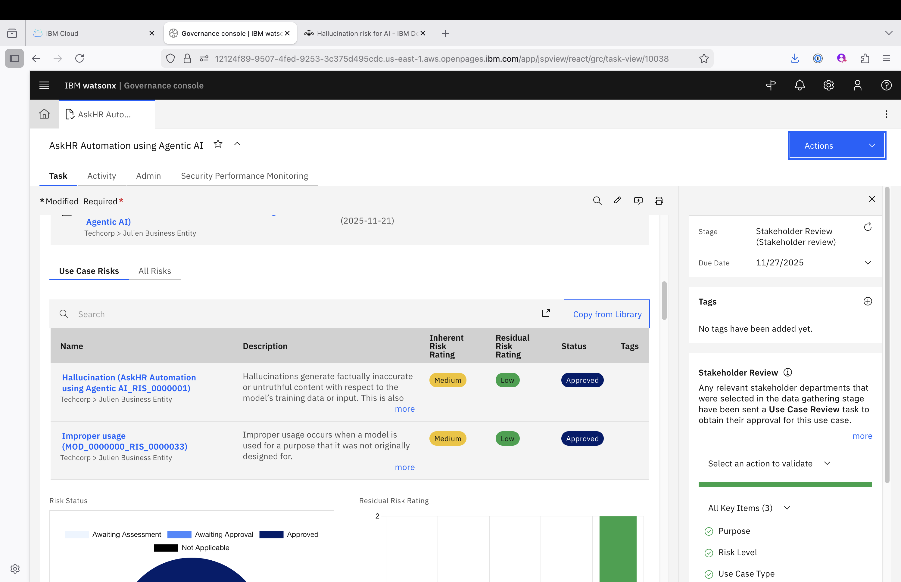

# **Stakeholder review – Business Unit Leader**

> **Login Note:** Ensure you are logged into **IBM OpenPages** as a **Business Unit Leader** to complete this task.
> This role performs the **final risk endorsement** before the risk becomes officially active for controls and monitoring.

---

## Task Summary

You have received the task in **My Tasks** with **Use case** name:
**“Use case Name- HR process automation using Agentic AI_< trigram >”**

As the Business Unit Leader, your role is to **approve or reject** a fully reviewed risk that has already passed through:

1. Risk Compliance Officer (RCO) review
2. Stakeholder validation

---

## Your Responsibilities

* Review all risk details submitted by the Use Case Owner
* Consider the inputs and approvals provided by previous reviewers
* Make the **final decision** for risk activation in OpenPages

---

## Steps to Complete

### 1. Open the Assigned Task

* Navigate to **My Tasks**
  

* Locate: **“HR process automation using Agentic AI”** which is **Usecase** name:

---

### 2. Review Risks and Reviews associated with the UseCase

Since all stakeholders have approved the Use Case, you may set the global Risk Rating for your Use Case in the Risk section of the Use Case record. This global risk rating can be implemented as a calculated field based on the individual stakeholder risk ratings if desired.

Click on Save to store the Global Risk Rating.

Finally, once all stakeholders have approved the Use Case, you can 

---

### 3. Approve or Reject the UseCase 

You can move the Use Case to the Approved for Development stage by clicking on the **Approve for Development** button in the Actions menu of the Use Case record.

Note all the possible actions available to you at this stage:

| Action    | Instruction                                     | Outcome                                   |
| --------- | ----------------------------------------------- | ----------------------------------------- |
| Approve | Set the **Status** to `Approved`                | Finalizes the risk for downstream linkage |
| Reject  | Set the **Status** to `Rejected` + add comments | Sends the risk back for revision          |

move the Use Case to the Approved for Development stage by clicking on the **Approve for Development** button in the Actions menu of the Use Case record.

---

## After You Submit

| If Approved                        | If Rejected                       |
| ---------------------------------- | --------------------------------- |
| Risk is now active                 | Sent back to Model Owner          |
| Can be linked to Controls & Issues | Requires updates and resubmission |

---

## Thank You!

Your review ensures only **well-governed, risk-aligned initiatives** move forward—upholding business, regulatory, and operational integrity.

---

[← Back to main guide](../../README.md) 
[← Back to directory](../../guides-directory.md)

