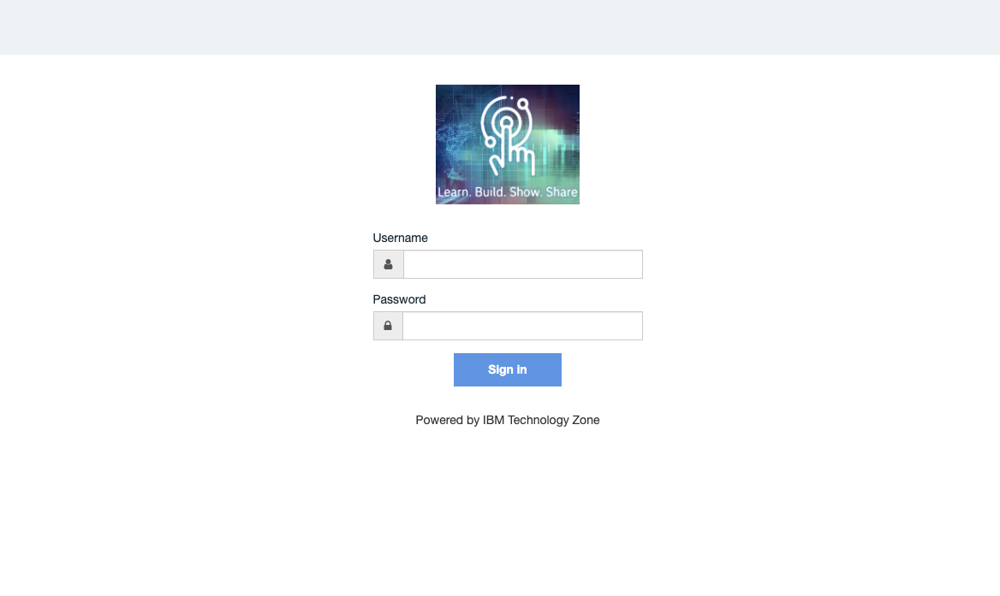
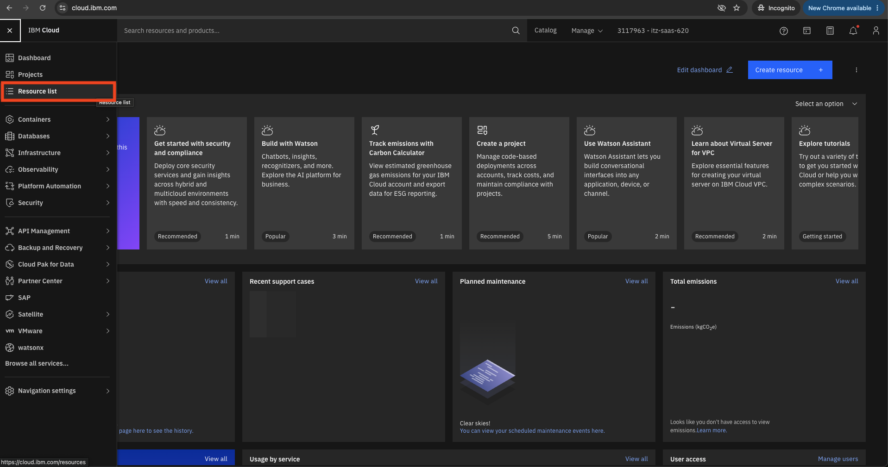
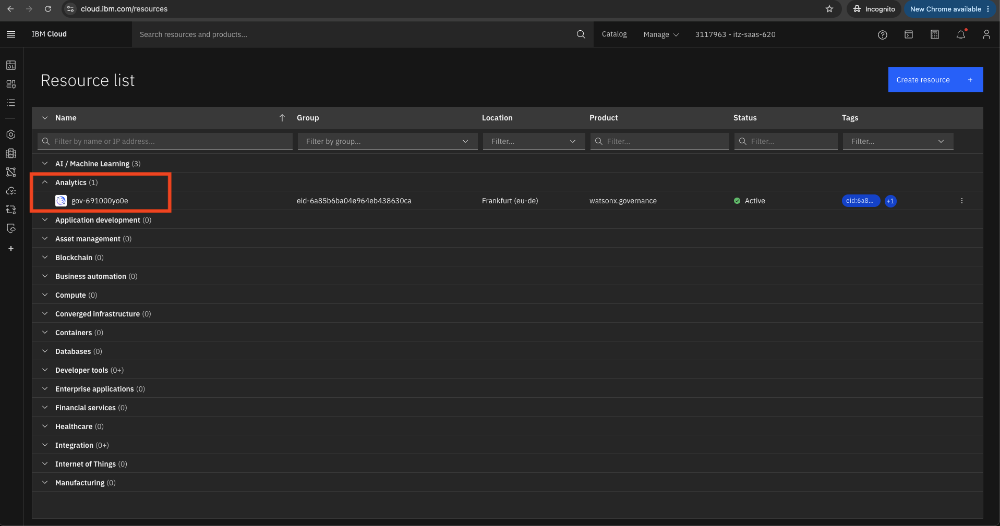

# Getting Started — Logging in to IBM OpenPages

Before you can begin any of the lab activities, you need to access **IBM OpenPages** through the IBM Cloud console. Follow the steps below carefully.

---

## Step 1 — Open the Login Page

Your instructor will share three things with you: a **link**, a **username**, and a **password**. The link will look similar to:

```
https://cloud.ibm.com/authorize/xxxxxxxxxxxxxxxxxxxxxxxxxxxxxxxx/xxxxxxxxxx
```

Click the link — it will take you to the **IBM Technology Zone login page**



Enter the **username** and **password** provided by your instructor, then click **Sign In**.

---

## Step 2 — Navigate to the Resource List

After signing in you will land on the **IBM Cloud** dashboard. Click the **hamburger menu** (☰) icon in the top-left corner, then click **Resource list**.



On the Resource list page, find the **Analytics** section. Click the arrow next to it to expand it if it is collapsed.

---

## Step 3 — Open the OpenPages Instance and Launch

Inside the **Analytics** section, look for the entry that starts with **`gov-`** (for example `gov-691000yo0e`). Click on it.



This opens the IBM OpenPages service management page. In the top-right corner, click the **Launch watsonx.governance** button. IBM OpenPages will open in a new tab.

---

## You're In!

Once OpenPages loads, make sure you are using the **watsonx-governance MRG Master** profile — this profile has the permissions needed to complete all lab activities across every persona.

> **Tip:** Keep this tab open throughout the entire session. All lab steps are performed inside IBM OpenPages (the tab that opened after clicking **Launch watsonx.governance**).

---

---

➡️ **Next Step:** [Use Case Creation](../1-use-case-creation/usecase-creation-model-owner.md)
