# Step 1c — Risk Review

> **Login Note:** Make sure you are logged into **IBM OpenPages** using the **watsonx-governance MRG Master** profile before starting this task. You are acting in the **Use Case Owner** role for this step.

 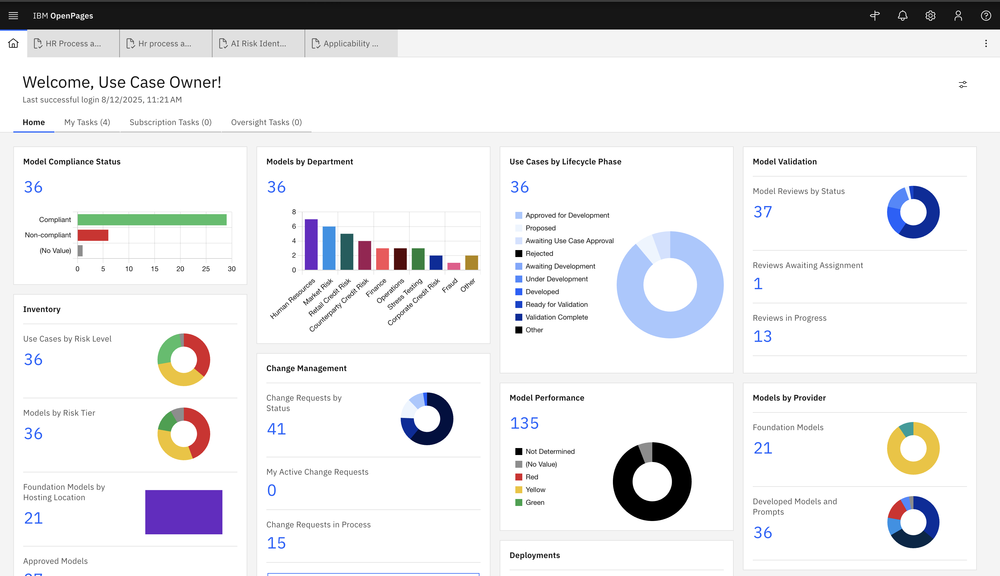

> As the Use Case Owner, you are responsible for reviewing and assessing each risk that was automatically generated from your questionnaire answers.

---

## Overview

As the **Use Case Owner**, your responsibility is to review each risk that was automatically assigned to your Use Case after the questionnaires were submitted. For each risk, you decide whether it applies to your situation, assess its severity, and document your mitigation plan. This process ensures all risks are evaluated, documented, and aligned with your organisation's governance standards before the Use Case can move forward.

---

## Workflow Context

This step occurs **after** a Use Case Owner:

* Creates a  Use Case, and
* Submits a Risk Identification Assessment.

You will now:

* Review the submitted risk,
* Perform assessments if necessary,
* Update the status, and
* Forward the task for stakeholder approval.

Steps:

| Step               | Action                        | Status Update                 |
| ------------------ | ----------------------------- | ----------------------------- |
| Risk Received      | Review risk description       | `Awaiting Assessment`         |
| Perform Assessment | (Optional) Add documentation  | `Awaiting Approval`           |
| Finalize Decision  | Approve / Mark Not Applicable | `Approved` / `Not Applicable` |

---

## Step-by-Step Task Instructions

### 1. Risks are populated and now **Use Case Owner** can review each risk:

  

---

### 2. Start Risk Assessment

* Open the risk record.
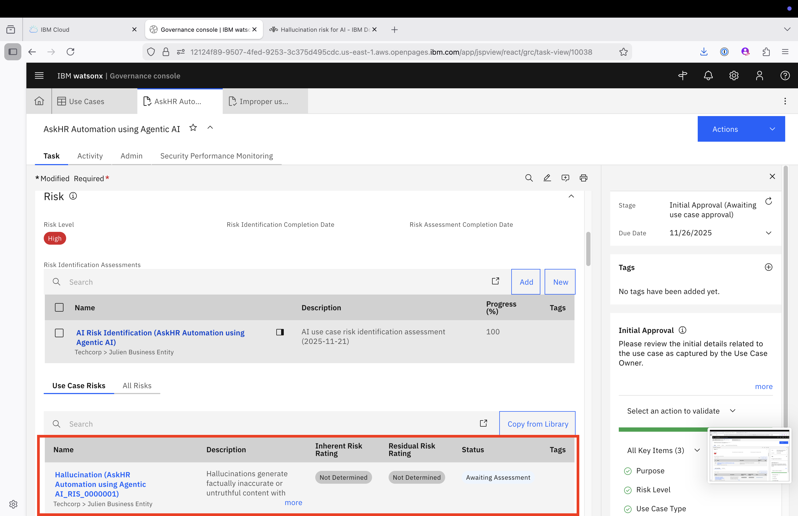

* Click on **Start Model Risk Assessment**, available on the Actions button. Click on Continue.

Then, click on the option **Ready for Assessment**, available on the Actions button.
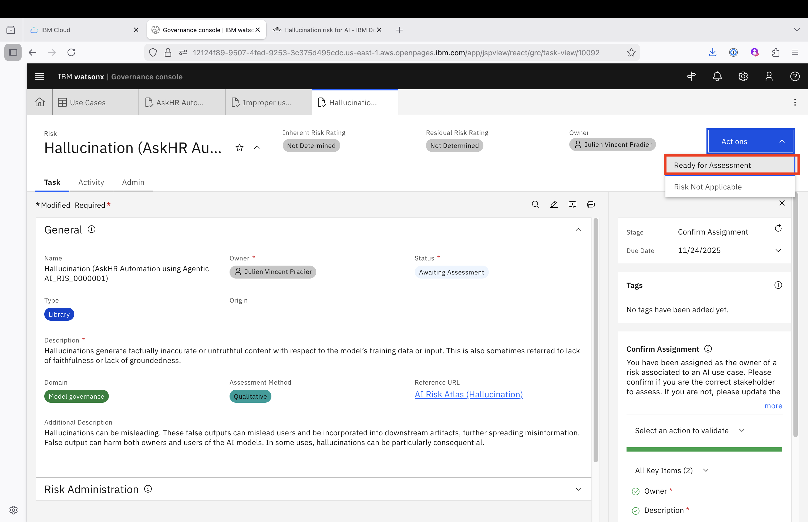

---

### 3. Decide if a Risk Assessment is Required

| If...                   | Then...                                         |
| ----------------------- | ----------------------------------------------- |
| Assessment is required  | Proceed to fill in the Risk Assessment section. |
| No assessment is needed | Move directly to setting the risk status.       |

---

### 4. Perform Risk Assessment

* Within the risk record, scroll to the **Risk Assessment** section.

> **What do these fields mean?**
> - **Inherent Risk Rating** — the severity of this risk *before* any controls or mitigations are in place. Set this by choosing the **Inherent Impact** (how bad the outcome would be) and **Inherent Likelihood** (how probable it is).
> - **Mitigation Strategy** — describe what you will do to reduce the risk. For an AI chatbot this typically means monitoring hallucination-related metrics like Answer Relevance and Faithfulness.
> - **Residual Risk Rating** — the severity that *remains after* your mitigations are applied. Set this by choosing **Residual Impact** and **Residual Likelihood**. Regulators such as the EU AI Act require documented evidence that risk owners have assessed not just the raw risk, but whether their controls are actually reducing it.

* Fill in the field values:

  * **Inherent Risk Rating** — set Inherent Impact and Inherent Likelihood
  * **Mitigation Strategy** — describe monitoring or controls in place (e.g. monitoring hallucination metrics)
  * **Residual Risk Rating** — set Residual Impact and Residual Likelihood

* Save and click on **Assessment Complete**:
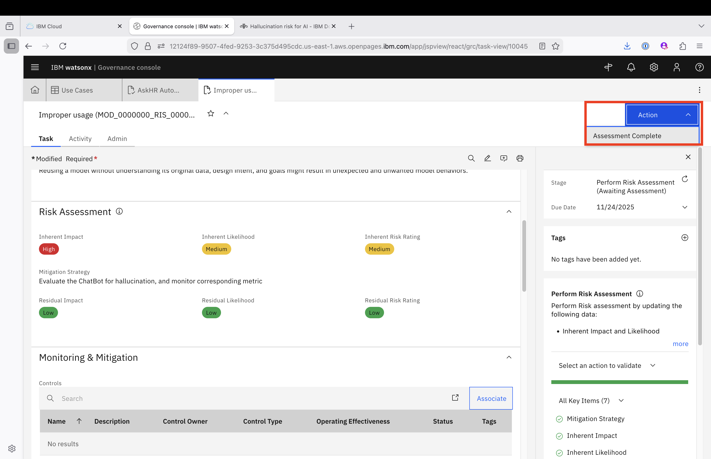

* Choose **Continue and close tab**

---

### 5. Save and Complete the Task

* After completing all risk review. Go to actions and click **Submit for Stakeholder Review** to progress the workflow to the Stakeholder stage.

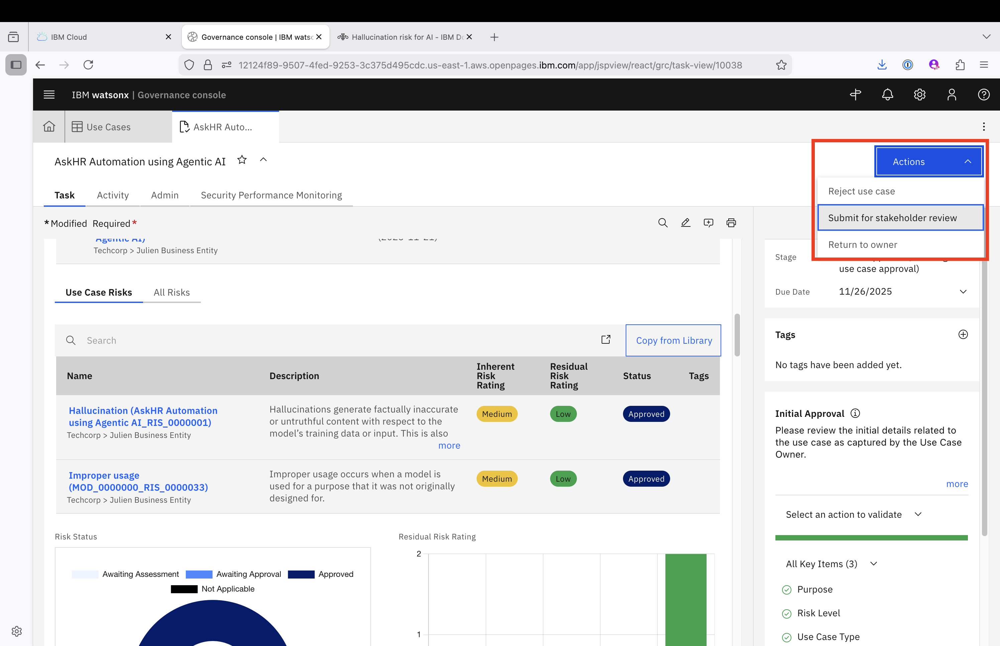

#### Process Several Risks — Bulk Operation

> [!NOTE]
> Use this procedure if you see the message: *"All associated risks should be assessed (marked as 'Approved' or 'Not Applicable') before submitting this use case for stakeholder review."*

* Click on the Launch Grid Page section
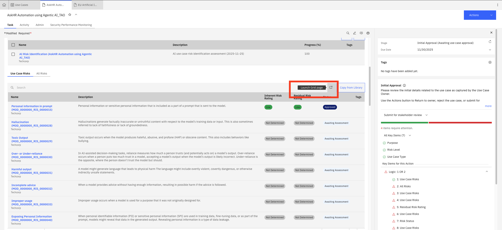

* Select all the risk with status "Awaiting Assessment", then click on "Bulk update"
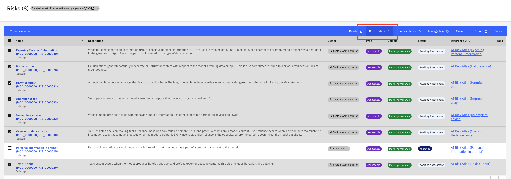

* Select field "Status", then click on "Not Applicable". Then, click on the button "Update"
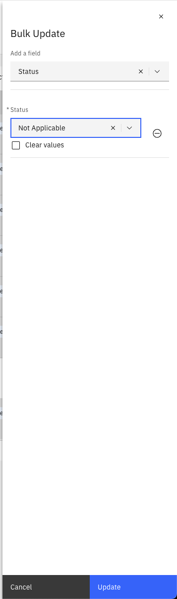

* Close the confirmation window
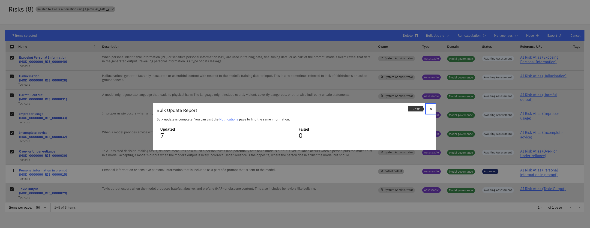

* Close the risk window tab.
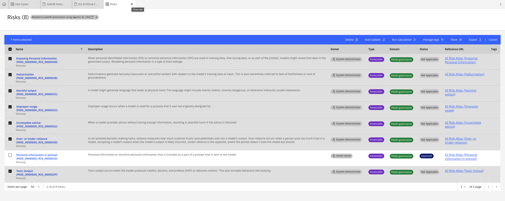

* Re-Open the Case. Go to actions and click **Submit for Stakeholder Review** to progress the workflow to the Stakeholder stage.

---

## Stakeholder Approval

Your Use Case has now been submitted for stakeholder review and approval. Before it can move to **Approved for Development**, the designated stakeholders must review it. Each stakeholder's review is found in the **Use Case Approvals** section of the Use Case record.
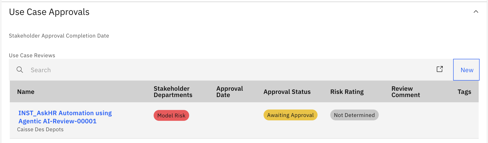

Click on the Use Case Review record to open it.

The Use Case Review record will follow a simple Use Case Stakeholder Review workflow as configured in the system:

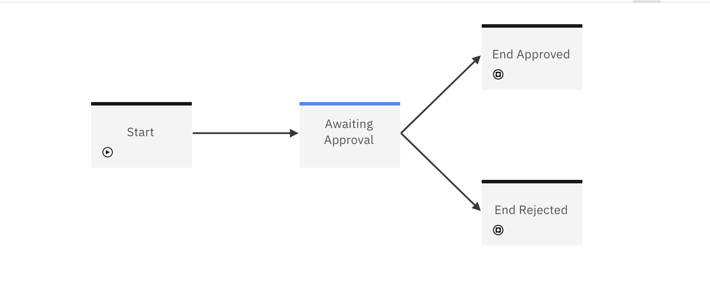

Before you can approve the Use Case, you may need to fill in some of the Use Case Review details:
- Stakeholder Name
- Stakeholder Comments
- Risk Rating

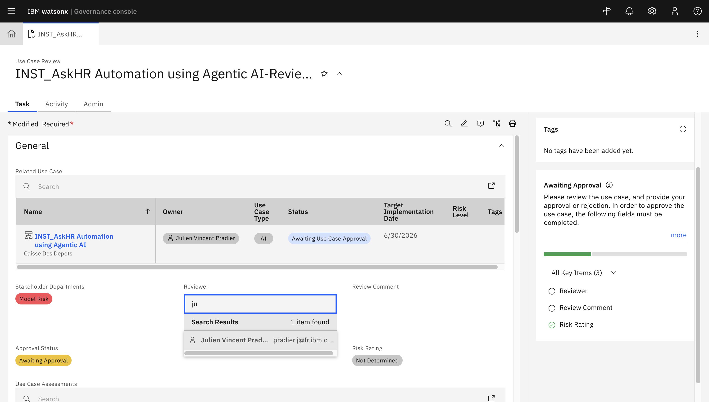

Once this information provided, you save and then click on the **Approve Use Case** button in the Actions menu.

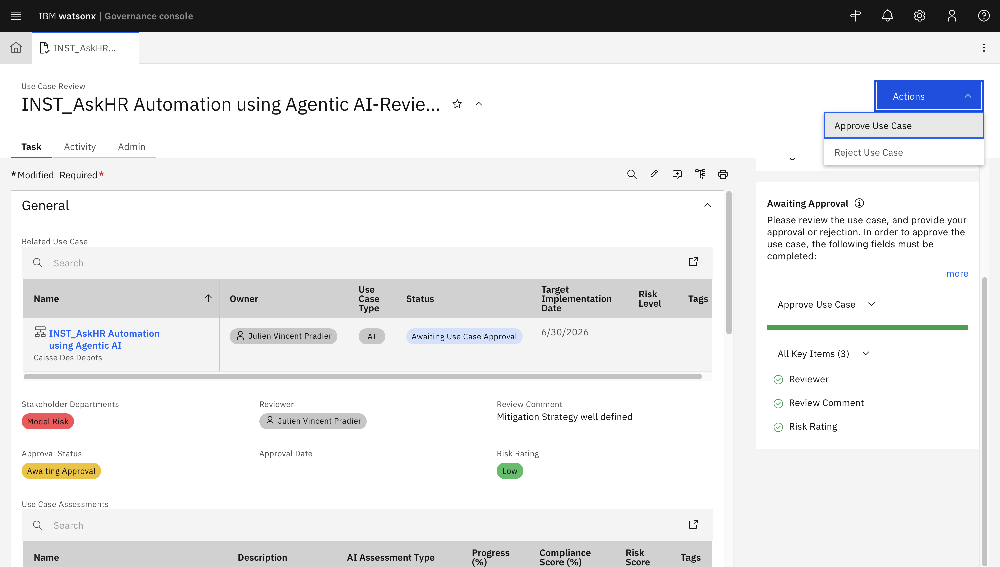

Click on **Continue and close tab** in the popup window and go back to your Use Case Record.

Ensure that all stakeholders have approved the Use Case.

---

## Well Done!

By completing the **Risk Review**, you help ensure:

* Risks are properly assessed and documented,
* Compliance is upheld,
* The organization follows a consistent and accountable risk management process.

---

➡️ **Next Step:** [Stakeholder Risk Endorsement](../2-risk-compliance-review/risk-endorsement-bul.md)

---

[← Back to main guide](../../README.md) 
[← Back to directory](../../guides-directory.md)

