# Creating Use Cases in watsonx.governance

> **Before starting:** Make sure you have completed [Step 00 — Getting Started](../0-getting-started/getting-started) and are logged in to **IBM OpenPages** using the **watsonx-governance MRG Master** profile.

---

## What is a  Use Case?

A **Use Case** in IBM OpenPages is used to document and govern one or more models developed to fulfil a specific business objective. It acts as a centralised record for model development, compliance, risk tracking, and approval workflows.

> **A Use Case should be created whenever there's a business requirement that needs one or more AI/ML assets (e.g., models, prompts, or agents).**

---

## Why Create a Use Case?

Creating a Use Case helps:

* Centralize governance of related models.
* Manage risks, compliance requirements, and ownership in one place.
* Track model performance and approvals across the model lifecycle.
* Link models to Business Entities for traceability and audit readiness.

---

## Step-by-Step Guide to Create a Use Case

### 1. Navigate to the Use Case Section

* Log in to IBM OpenPages using the **watsonx-governance MRG Master** profile (see the Getting Started section in the [main guide](../../README.md) if needed).
* Click on the **Hamburger Menu**.
* Go to **Inventory**.
* Select **Use Case**.

---

### 2. Click **“Create New”**

* Click the **Create New** button at the top of the Use Case list view.

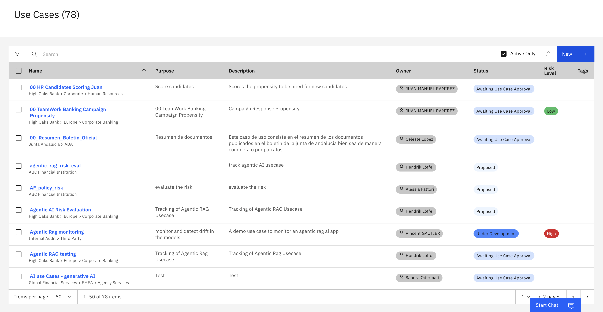

---

### 3. Fill in the Required Fields

Fill in the form using the following example:

| Field                       | Example Entry                                   |
| --------------------------- | ----------------------------------------------- |
| **Name**                    | `<initials>_AskHR Automation using Agentic AI` |
| **Owner**                   | Use Case Owner : select user used to log into the platform - e.g studentxx@techzone.ibm.com.                                     |
| **Purpose**                 | Automate HR processes using Generative AI.      |
| **Description**             | This use case tracks GenAI-based HR automation. |
| **Use Case Type**           | AI                                              |
| **Primary Business Entity** | Techcorp                                        |

> *Use your initials to make the Use Case name unique so it is easy to find later. Example: Andrew Smith → `AS_AskHR Automation using Agentic AI`

> All required fields must be completed before you can save.

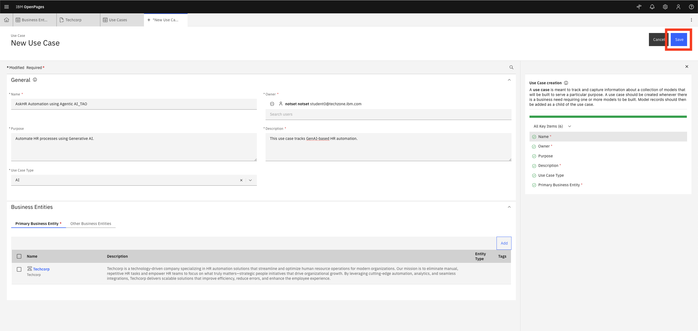

---

### 4. Save the Use Case

* Click **Save** to create and register the Use Case record.

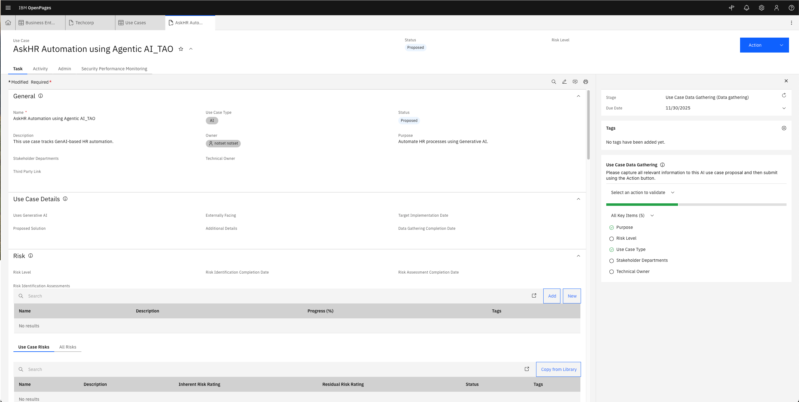

---

### 5. Set Technical Owner, Stakeholder Department

After saving:

* Open the newly created Use Case.
* Select the **Technical Owner** — set it to your own login account.
* Select the **Stakeholder Department** — set it to **Model Risk**.
* Click **Save** again.

**Note:** you can also set the risk level at this point. This is optional and does not block the workflow.
* Scroll down to the **Risk** section.
* Select an appropriate **Risk Level** (Low, Medium, or High).

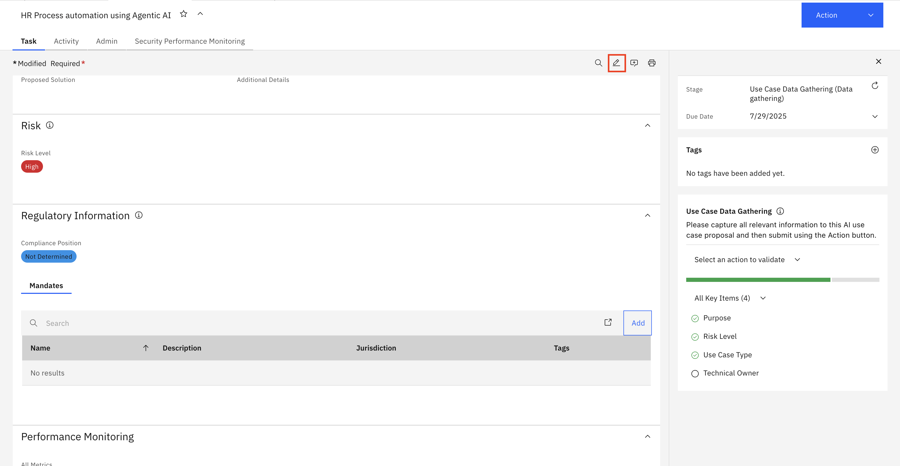

---

## Example Use Case Summary

| Field               | Value                                    |
| ------------------- | ----------------------------------------- |
| **Name**            | `<initials>_AskHR Automation using Agentic AI` |
| **Owner**           | Use Case Owner : select user used to log into the platform. - e.g studentxx@techzone.ibm.com.                           |
| **Purpose**         | Automate HR tasks using Generative AI    |
| **Description**     | Tracks GenAI model for internal HR tasks |
| **Business Entity** | Techcorp                                 |
| **Risk Level**      | High                                     |
| **Use Case Type** | AI                                        |
| **Technical Owner** | Technical Case Owner : select user used to log into the platform.                                        |
| **Stakeholder Department** | Model Risk                                     |

After setting the risk level, go to the action tab and click on **Submit for initial approval**.

> [!NOTE]
> In some OpenPages environments, the action is labeled **Submit for Risk Assessment** instead of **Submit for initial approval**. If you see **Submit for Risk Assessment**, use that action to continue.

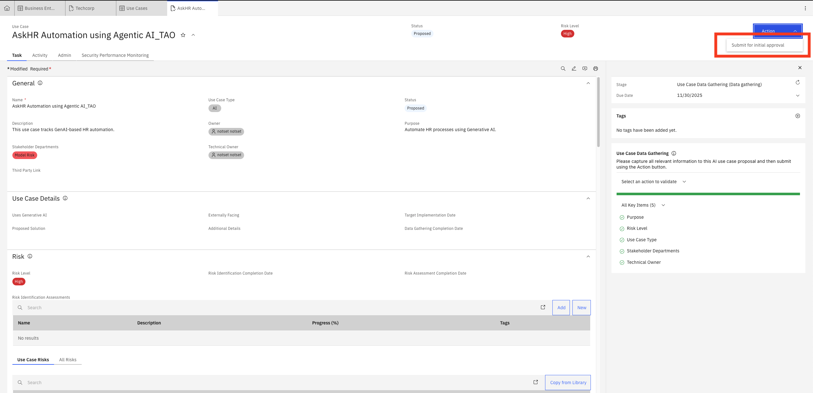

**Click on the button "Continue" in the popup window**

### 6. Open the Questionnaire Assessment 

There are several ways to open the Questionnaire Assessment. The most optimal is to open the Risk Assessment directly from the Use Case. Search for the Risk section.

> [!NOTE]
> In some OpenPages environments, the questionnaire tasks appear under **Home → My Tasks** as separate items such as **AI Risk Identification** and **Applicability Assessment**. If your screen looks different from the screenshots below, open the assessments from **My Tasks** and continue.

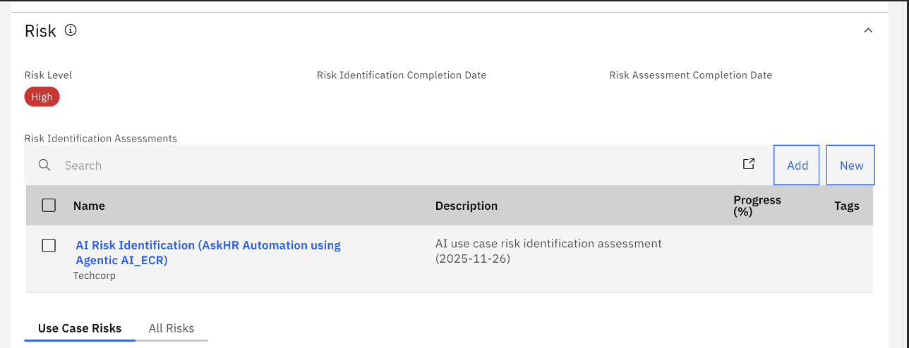

Another way is to open the Questionnaire Assessment from the task menu. Go to Home, then "My Tasks".

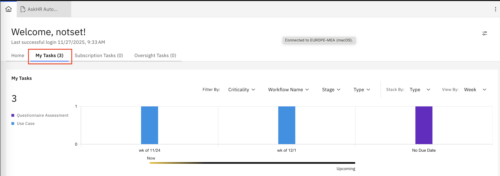  

Other way is to open the Questionnaire Assessment from the main menu.
* Click on the **Hamburger Menu**.
* Go to **Assessment**.
* Select **Questionnaire Assessment**.

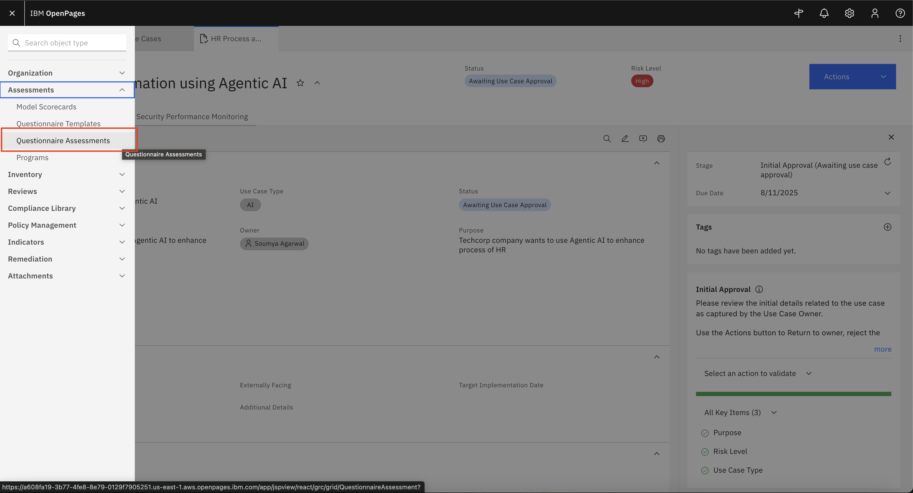  

### 7. Complete Risk Assessment

> **Why do these answers matter?** The answers you give here determine which regulatory risks are automatically assigned to your Use Case. For our scenario — an AI chatbot that processes employee HR queries — you must answer **Yes** to the personal information and user-generated content questions. If you answer No, fewer risks are generated and the Use Case will not reflect the full compliance picture required by the EU AI Act.

In the Questionnaire Assessment page,

* Click on the Risk Assessment associated with the Use Case.

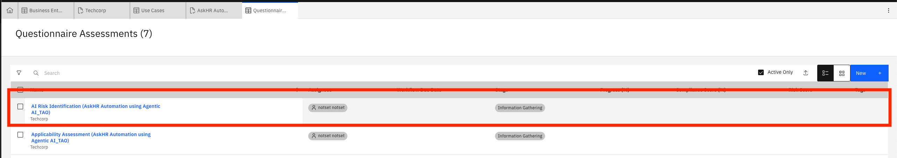

* Fill out all required questions in the Risk Assessment Questionnaire, such as:

  a. What type of data is being used?

  b. Is the Use Case customer-facing?

  c. What is the impact of a model failure?

  d. What mitigations are in place?

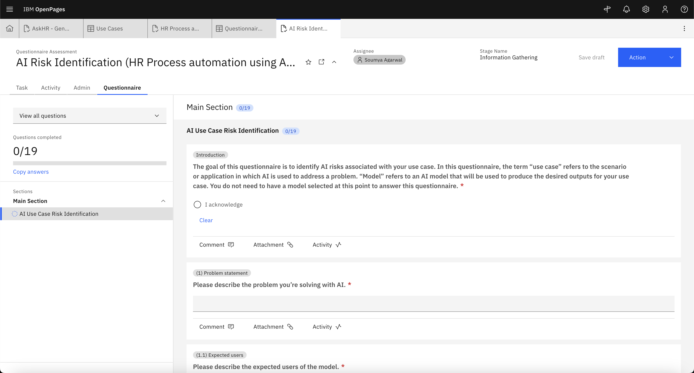

* Use dropdowns, radio buttons, and text fields as applicable.

  a. Make sure you select **Yes** for the question "Will the model input include content provided or created by people?"

  b. Select **Yes** for the question "Will the model input include personal information?"

* Click **Submit and close** on the Actions tab once all questions are answered.

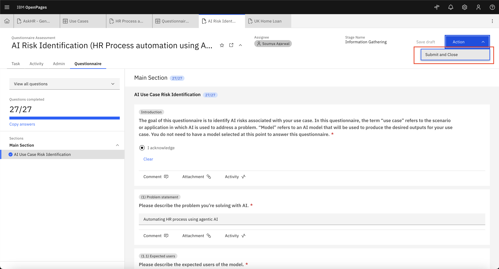 

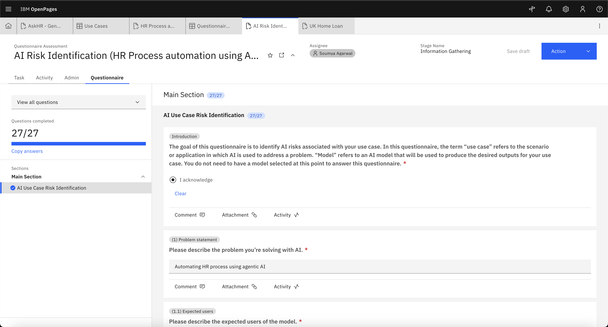  

#### Copy Answers

> [!NOTE]
> You can copy answers from another assessment using the **Copy Answers** option available in the assessment.

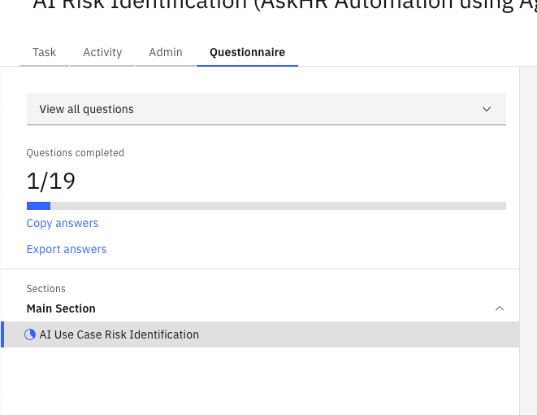

### 8. Complete Compliance Assessment

> **Why does this assessment exist?** The EU AI Act Compliance Assessment maps your Use Case to the specific articles and obligations in the regulation. Your answers determine which EU AI Act requirements apply to your Use Case — this is what makes the system audit-ready. An AI chatbot that processes employee personal data falls under the **Limited Risk** category and triggers specific transparency and data governance obligations.

In the Questionnaire Assessment page,

* Click on the Compliance Assessment associated with the Use Case (EU AI Act).

* Fill out all required questions in the Compliance Assessment Questionnaire.

> **Note:** For questions about whether the model processes user-generated content or personal information, answer **Yes** — this applies to our HR chatbot. Use **No** only when a risk or obligation clearly does not apply to your specific use case. If unsure, default to Yes and document your reasoning — it is safer from an audit perspective to have a risk on record than to miss one.

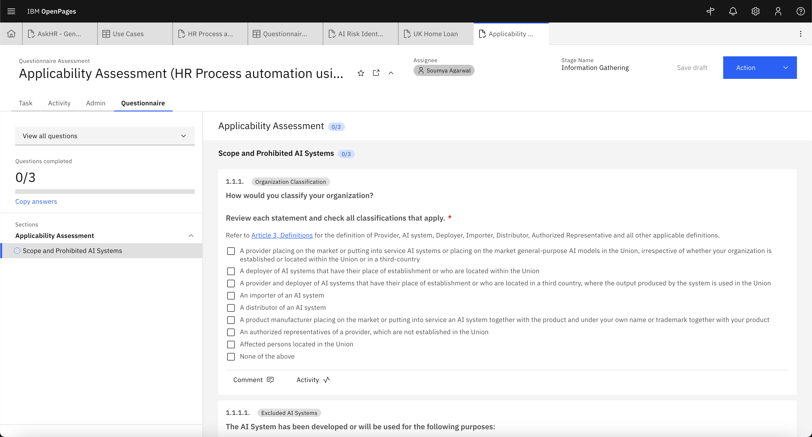  

* Use dropdowns, radio buttons, and text fields as applicable.

* Click **Submit and close** on Actions tab once all questions are answered.

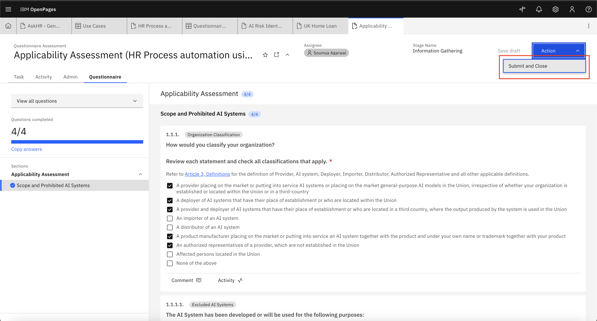  

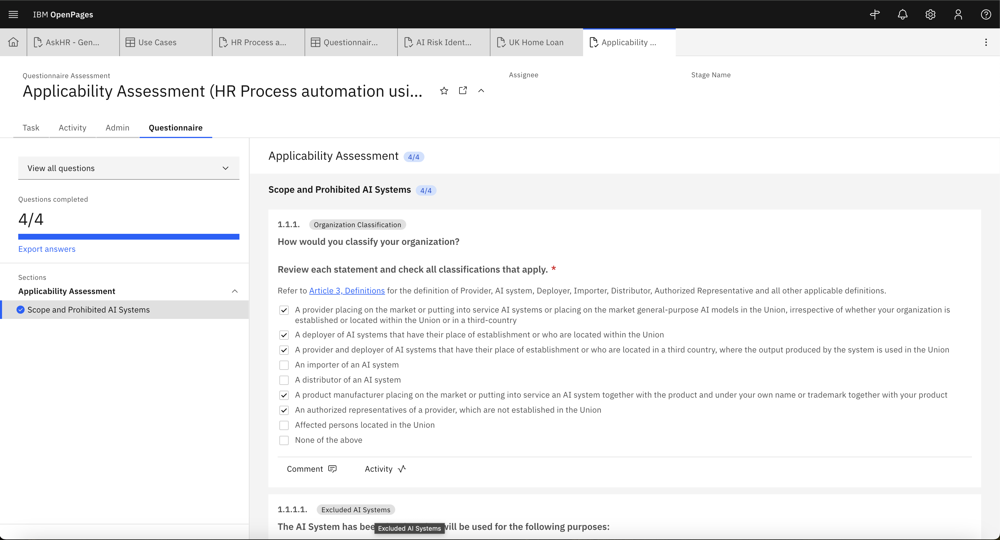  

Once both assessments are submitted, the risks will be assigned for the use case.

- After the assessments, go back to your use case. You can see risks associated in the **Risk** list section:

 

- You can also see the EU AI Risk Category automatically set after the applicability assessment in the use case In **regulatory information** section. Proceed to add the **mandates** tab and click on **Add**

 

- Select appropriate **Mandates or Risk & Compliance Act** and associate to the use case. Make sure that you select the **EU Artificial Intelligence Act**

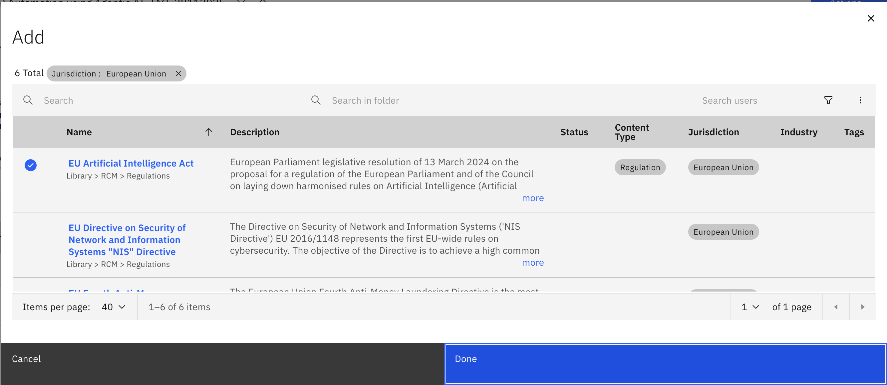 

-Now you can see in **mandates** section **Mandates or Risk & Compliance Act** are added.  Make sure that you select the **EU Artificial Intelligence Act**

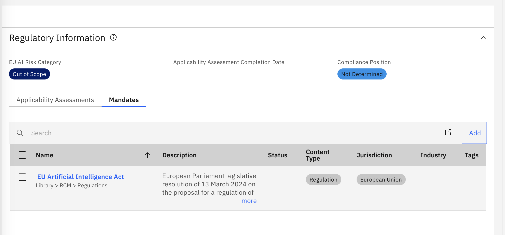 

Now you can proceed to the Risk assessment process by clicking on below link:

* [Review and Assess Risk](./risk-review-rco.md)

---

## Well Done!

You have successfully created a **Model Use Case** and filled out assessments in watsonx.governance.

This enables:

* Structured governance
* Risk and compliance tracking
* Streamlined collaboration across stakeholders

Use Cases provide visibility, traceability, and control across the lifecycle of AI models.

---

➡️ **Next Step:** [Review and Assess Risks](./risk-review-rco.md)

---

[← Back to main guide](../../README.md) 
[← Back to directory](../../guides-directory.md)
