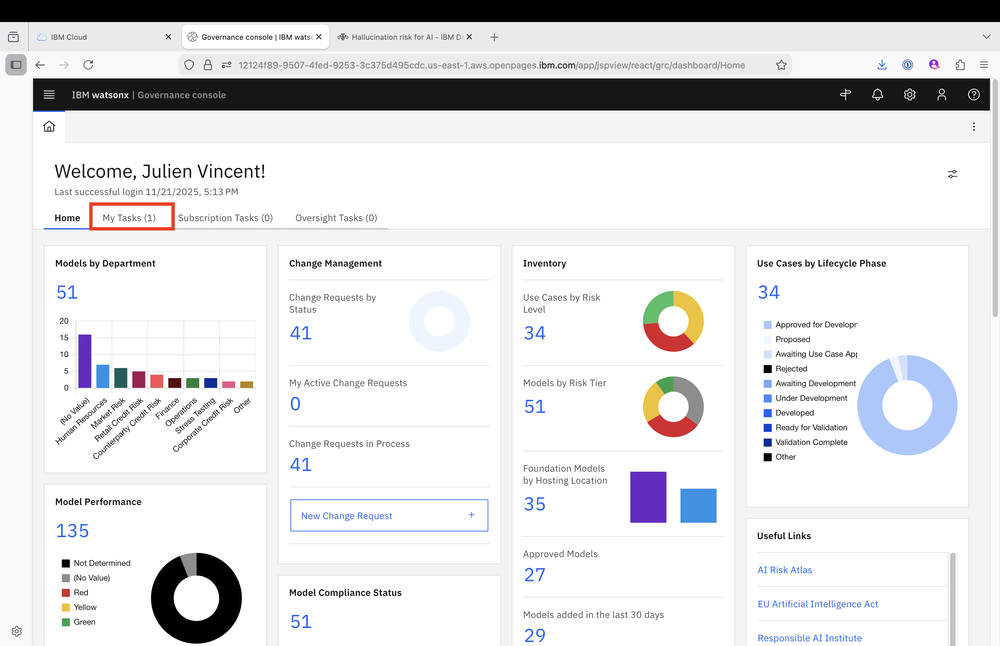
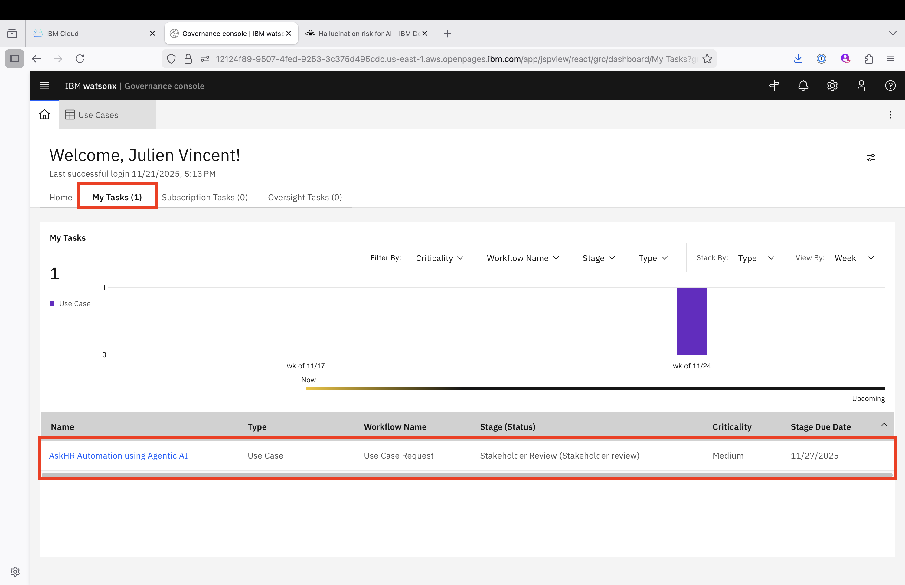
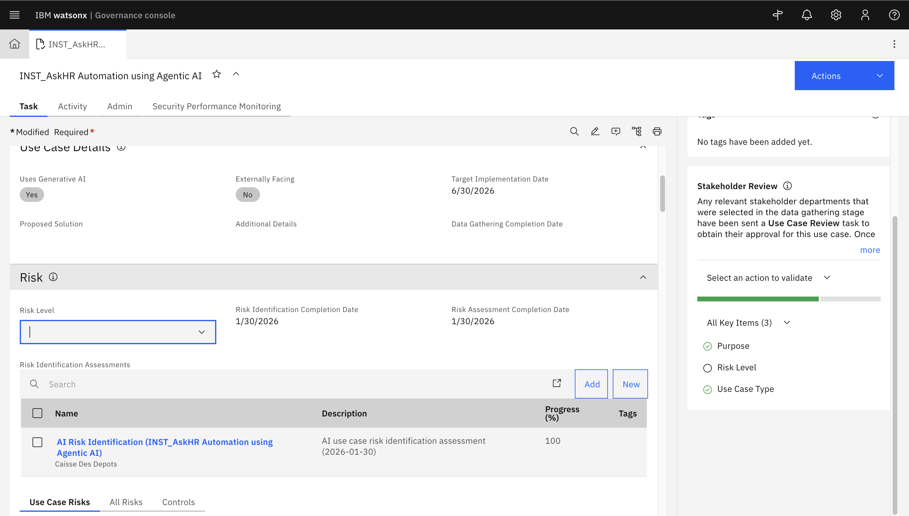
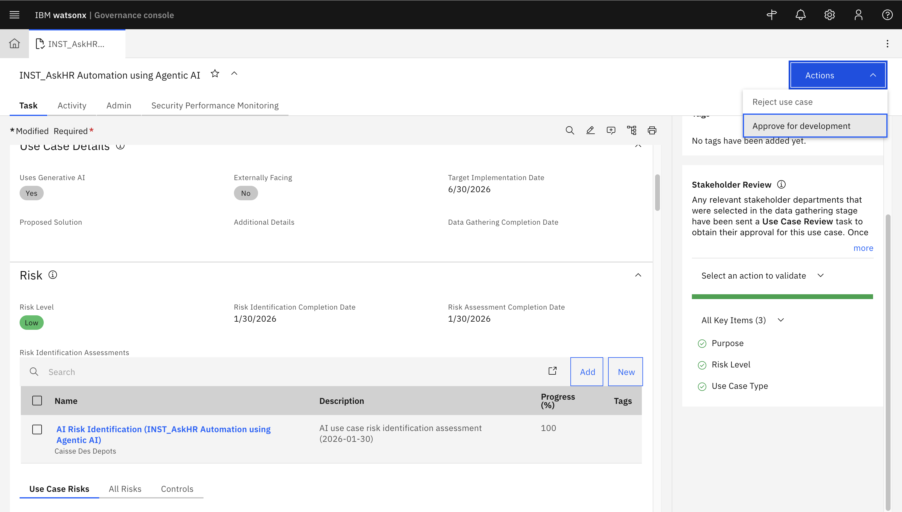

# **Stakeholder Review — Business Unit Leader**

> **Login Note:** Ensure you are logged into **IBM OpenPages** using the **watsonx-governance MRG Master** profile before starting this task.
> This role performs the **final risk endorsement** before the risk becomes officially active for controls and monitoring.

---

## Task Summary

You have received the task in **My Tasks** with your **Use Case** name:
**"&lt;initials&gt;_AskHR Automation using Agentic AI"**

As the Business Unit Leader, your role is to **approve or reject** a Use Case that has already passed through:

1. Risk Compliance Officer (RCO) review
2. Stakeholder validation

---

## Your Responsibilities

* Review all risk details submitted by the Use Case Owner
* Consider the inputs and approvals provided by previous reviewers
* Make the **final decision** for risk activation in OpenPages

---

## Steps to Complete

### 1. Open the Assigned Task

* Navigate to **My Tasks**
  

* Locate your Use Case — it will be named **"&lt;initials&gt;_AskHR Automation using Agentic AI"**:

---

### 2. Review Risks Associated with the Use Case

Since all stakeholders have approved the Use Case, you may set the global Risk Rating for your Use Case in the Risk section of the Use Case record.

> **Why set a Global Risk Rating?** Individual stakeholders each provide their own risk rating during review. The Global Risk Rating rolls these up into a single consolidated value that travels with the Use Case through the rest of its lifecycle — it is the figure that will appear in dashboards, audit reports, and downstream risk controls.

Click **Save** to store the Global Risk Rating. You are now ready to give the final approval — proceed to Step 3.

---

### 3. Approve or Reject the Use Case

You can move the Use Case to the **Approved for Development** stage by clicking **Approve for Development** in the Actions menu of the Use Case record.

Note all the possible actions available to you at this stage:

| Action    | Instruction                                          | Outcome                                              |
| --------- | ---------------------------------------------------- | ---------------------------------------------------- |
| Approve   | Click **Approve for Development** in the Actions menu | Use Case moves to the Development stage              |
| Reject    | Click **Reject** + add comments                      | Use Case is returned to the Use Case Owner for revision |

Click **Approve for Development** in the Actions menu of the Use Case record.

---

## After You Submit

| If Approved                                       | If Rejected                                      |
| ------------------------------------------------- | ------------------------------------------------ |
| Use Case status moves to **Approved for Development** | Use Case is returned to the Use Case Owner       |
| Model Developer is notified and can begin work    | Requires updates and resubmission for re-review  |

---

## Thank You!

Your review ensures only **well-governed, risk-aligned initiatives** move forward—upholding business, regulatory, and operational integrity.

---

➡️ **Next Step:** [Step 4 — Incident Management](../4-incident-management/mitigating-incidents.md)

> Step 3 (AI Lifecycle Walkthrough) was completed before the session — read it at your own pace for context on what happened between this step and Step 4.

---

[← Back to main guide](../../README.md) 
[← Back to directory](../../guides-directory.md)

